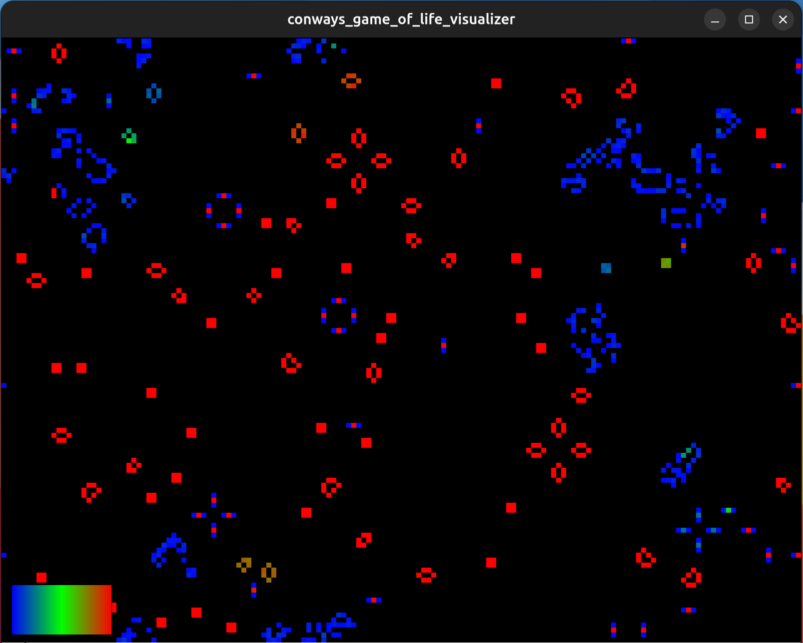

# Conway's Game of Life – Resizable Heatmap Visualizer

## Description

This project is a **Processing sketch** that implements **Conway's Game of Life** with enhanced visualization features. The program displays a grid of cells that evolve according to the classic rules of the Game of Life, with additional tracking of **cell age** and a **heatmap color scheme** to highlight the lifespan of each cell.

### Features

- **Resizable Window:** The simulation automatically adjusts the number of rows and columns when the user resizes the window.
- **Cell Age Tracking:** Each alive cell keeps track of how many consecutive generations it has been alive.
- **Heatmap Coloring:** Cell age is mapped to a gradient color scale (Blue → Green → Red) to visually distinguish young, middle-aged, and old cells.
- **Legend Display:** A color legend is drawn on the screen to indicate the mapping between cell age and color.
- **Trails Mode Support:** While not enabled by default, the sketch can be modified to leave fading trails of previous generations by not clearing the background each frame.

## How It Works

The program is organized into **three main components**:

1. **GameOfLife**
   - Manages the 2D grid of cells.
   - Handles initialization, resizing of the grid, and updating cells based on Conway's rules.
   - Implements wrap-around edges (the grid behaves like a torus).

2. **Cell**
   - Represents a single cell in the grid.
   - Stores whether the cell is alive and its age.
   - Updates its state according to the next generation.

3. **Visualizer**
   - Draws the current state of the grid on the screen.
   - Maps cell age to a heatmap color for live cells and uses black for dead cells.

4. **Legend**
   - Draws a horizontal color gradient and labels to indicate how cell age corresponds to the heatmap.
   - Adjusts its position dynamically if the window is resized.

The main Processing sketch (`setup()` and `draw()` functions) initializes these components and orchestrates the simulation loop:

- **`setup()`**: Initializes the window, grid, visualizer, and legend.
- **`draw()`**: Clears the background, updates the grid to the next generation, draws the cells, and displays the legend.

---

## Usage

1. Open the project in **Processing 3+**.
2. Run the sketch.
3. Resize the window to see the grid automatically adapt.
4. Observe the heatmap coloring representing the age of cells.

---

## License

This project is released under the **GPL v3 License**.
